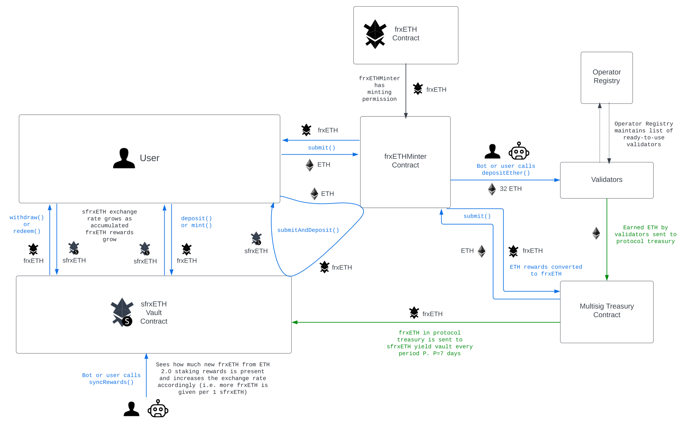

# Frax Staked Ethereum
## Flowchart

## Overview Documentation
[https://docs.frax.finance/frax-ether/overview](https://docs.frax.finance/frax-ether/overview).


<!-- //////////////////////////////////////////////////////////////// -->
# Building and Testing
## Setup
1) ```git clone https://github.com/FraxFinance/frxETH-public.git --recurse-submodules --remote-submodules```
2) Install [foundry](https://book.getfoundry.sh/getting-started/installation)
3) ```forge install```
4) ```git submodule update --init --recursive```
4a) ```cd ./lib/ERC4626 && git checkout main```. This should switch it to ```corddry```'s fork.
5) (Optional) Occasionally update / pull your submodules to keep them up to date. ```git submodule update --recursive --remote```
6) Create your own .env and copy SAMPLE.env into there. Sample mainnet validator deposit keys are in test/deposit_data-TESTS-MAINNET.json if you need more.
7) You don't need to add PRIVATE_KEY, ETHERSCAN_KEY, or FRXETH_OWNER if you are not actually deploying on live mainnet

### Forge
Manually, forced
```forge build --force```

## Testing
### General / Helpful Notes
1) If you want to add more fuzz cycles, edit foundry.toml
2) Foundry [cheatcodes](https://book.getfoundry.sh/cheatcodes/)
### Forge
Most cases
```source .env && forge test -vv```

If you need to fork mainnet
```source .env && forge test --fork-url $MAINNET_RPC_URL -vv```

If you need to fork mainnet, single test contract
```source .env && forge test --fork-url $MAINNET_RPC_URL -vv --match-path ./test/frxETHMinter.t.sol```

Verbosely test a single contract while forking mainnet
or ```source .env && forge test --fork-url $MAINNET_RPC_URL -m test_frxETHMinter_submitAndDepositRegular -vvvvv``` for single test verbosity level 5


### Other Scipts
tsx validate-msig-add-validators.ts

DepositDataToCalldata: SEE THE DepositDataToCalldata.s.sol FILE ITSELF FOR INSTRUCTIONS

### Slither
1) Install [slither](https://github.com/crytic/slither#how-to-install)
2) Slither a single contract
```slither ./src/sfrxETH.sol --solc-remaps "openzeppelin-contracts=lib/openzeppelin-contracts ERC4626=lib/ERC4626/src solmate=lib/solmate/src"```


<!-- //////////////////////////////////////////////////////////////// -->
# Deployment & Environment Setup
## Deploy
1) Deploy frxETH.sol
2) Deploy sfrxETH.sol
3) Deploy frxETHMinter.sol
4) Add the frxETHMinter as a valid minter for frxETH
5) (Optional, depending on how you want to test) Add some validators to frxETHMinter

### Goerli
#### Single deploy
```source .env && forge create src/frxETH.sol:frxETH --private-key $PRIVATE_KEY --rpc-url $GOERLI_RPC_URL --verify --optimize --etherscan-api-key $ETHERSCAN_KEY --constructor-args $FRXETH_OWNER $TIMELOCK_ADDRESS```

#### Group deploy script
Goerli
```source .env && forge script script/deployGoerli.s.sol:Deploy --rpc-url $GOERLI_RPC_URL --private-key $PRIVATE_KEY --broadcast --verify --etherscan-api-key $ETHERSCAN_KEY```
Mainnet
```source .env && forge script script/deployMainnet.s.sol:Deploy --rpc-url $MAINNET_RPC_URL --private-key $PRIVATE_KEY --broadcast --verify --etherscan-api-key $ETHERSCAN_KEY```

#### Etherscan Verification
Sometimes the deploy scripts above fail with Etherscan's verification API. In that case, use:
```forge flatten src/frxETHMinter.sol -o flattened.sol```
Then do
```sed -i '/SPDX-License-Identifier/d' ./flattened.sol && sed -i '/pragma solidity/d' ./flattened.sol && sed -i '1s/^/\/\/ SPDX-License-Identifier: GPL-2.0-or-later\npragma solidity >=0.8.0;\n\n/' flattened.sol```

## Development
To make new dependencies play nicely with VSCode:
```forge remappings > remappings.txt```

<!-- //////////////////////////////////////////////////////////////// -->
# Contracts Under Review
## ERC20PermitPermissionedMint.sol
Parent contract for frxETH.sol. Has EIP-712/EIP-2612 permit capability, is burnable, and has an array of authorized minters. Is also owned.
## frxETH.sol 
Basically the same as ERC20PermitPermissionedMint.sol
## frxETHMinter.sol
Authorized minter for frxETH. Users deposit ETH for frxETH. It then deposits that ETH into ETH 2.0 staking validators to earn yield. It can also withhold part of the ETH deposit for future use, such as to earn yield in other places to supplement the ETH 2.0 staking yield.
## OperatorRegistry.sol
Keeps track of available validators to add batches of 32 ETH to. Contains various array manipulations. It is assumed that validator checks for validity, as well as ordering in the array, are done off-chain to save gas beforehand.
## sfrxETH.sol
Autocompounding vault token for frxETH. Users deposit their frxETH for sfrxETH. Adheres to ERC4626/xERC4626. Any rewards earned externally, such as from ETH 2.0 staking, are converted to frxETH then sent here. After that happens, the exchange rate / pricePerShare for the sfrxETH token increases and sfrxETH hodlers can exchange their sfrxETH tokens for more frxETH than they initially put in (this is their rewards). Has EIP-712/EIP-2612 permit capability.

<!-- //////////////////////////////////////////////////////////////// -->
# Contracts Included but not under review
## ERC4626.sol, xERC4626.sol
Already audited several times.
## DepositContract.sol
Official Ethereum 2.0 deposit contract.
## Owned.sol
Synthetix.io created.
## SigUtils.sol
Only used for testing, so no need to audit.
## ERC20Permit, ERC20Burnable, etc
Openzeppelin created contracts are already extensively audited.

<!-- //////////////////////////////////////////////////////////////// -->
# Known Issues
### xERC4626.sol
xTRIBE, which is xERC4626.sol based and has some functions that sfrxETH.sol uses, has two known medium severity corner case issues [M-01](https://code4rena.com/reports/2022-04-xtribe/#m-01-xerc4626sol-some-users-may-not-be-able-to-withdraw-until-rewardscycleend-the-due-to-underflow-in-beforewithdraw) and 
[M-02](https://github.com/code-423n4/2022-04-xtribe-findings/issues/66)
### OperatorRegistry.sol
No checking for valid validator pubkeys, signatures, etc are done here. They are assumed to be done off chain before they are added. However, the official ETH 2.0 DepositContract.sol DOES do checks and will revert if something is wrong. It is assumed that the team, or the manager(s) of the OperatorRegistry.sol contract will remove/replace the offending invalid validators.


<!-- //////////////////////////////////////////////////////////////// -->
# Contest Scope
- frxETH Repository: [https://github.com/FraxFinance/frxETH-public](https://github.com/FraxFinance/frxETH-public)
- 5 Non-library contracts in the scope
- 365 Total sLoC in scope.
- Contracts use inheritance, most of the parents are time/battle tested Openzeppelin or other contracts
- Most public interaction will be with frxETHMinter.sol, then sfrxETH.sol 
- frxETH.sol conforms to EIP-712/EIP-2612 and ERC-20 standards and uses Openzeppelin and Synthetix.io parents
- sfrxETH.sol conforms to EIP-712/EIP-2612, ERC-4626, and ERC-20 standards
- No novel or unique curve logic or mathematical models
- Not an NFT
- Not an AMM
- Not a fork of a popular project
- Does not use rollups
- Single-chain only